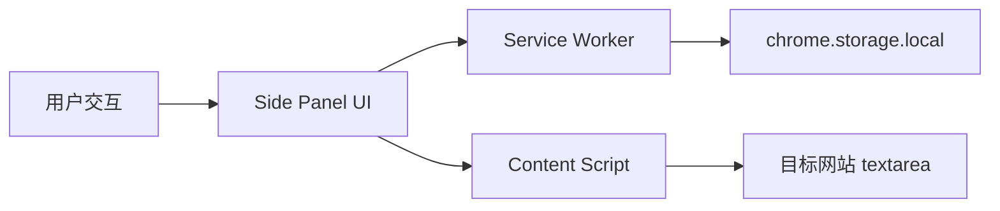
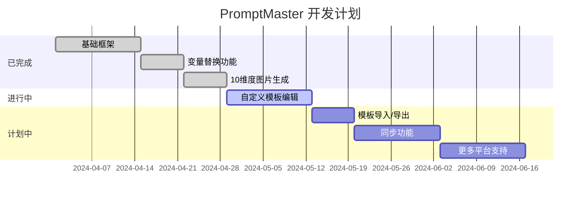

# 🎨 PromptMaster - AI 提示词模板管理插件

<div align="center">


**一个高效的 AI 提示词管理工具，支持变量替换、10维度图片生成、多平台自动填入**

[功能介绍](#-功能简介) · [快速开始](#-快速开始) · [功能详情](#-功能详情) · [架构设计](#-架构设计) · [开发指南](#-开发指南) · [常见问题](#-常见问题)

</div>

---

## ⚡ 1 分钟快速开始

### 安装步骤

```bash
# 1. 克隆项目
git clone https://github.com/你的用户名/promptmaster.git
cd promptmaster

# 2. 安装依赖
npm install

# 3. 构建生产版本
npm run build

# 4. Chrome 中加载扩展
# - 打开 chrome://extensions/
# - 开启「开发者模式」
# - 点击「加载已解压的扩展程序」
# - 选择 dist/ 目录
```

### 使用流程

```
1. 点击 Chrome 工具栏的插件图标打开侧边栏
2. 选择提示词模板（如「BROKE 框架」）
3. 填写变量（支持多选下拉和文本输入）
4. 点击「复制」或「自动填入」
5. 粘贴到 ChatGPT/Claude/Gemini/DeepSeek 使用
```

---

## 🚀 功能简介

### 核心能力

| 功能 | 说明 |
|------|------|
| 📋 **模板管理** | 内置 BROKE、CO-STAR、CRISPE、RTF 等提示词框架 |
| 🎨 **图片生成** | 10维度选择器，组合生成完整图片提示词 |
| 🔄 **变量替换** | 支持 `{{变量名}}` 语法，灵活填充内容 |
| ⭐ **收藏夹** | 一键收藏常用模板，快速访问 |
| 📁 **文件夹** | 自定义分类，整理不同类型模板 |
| 🏷️ **标签系统** | 多维度标签筛选，快速定位模板 |
| 📝 **自动填入** | 自动填充到各大 AI 平台输入框 |
| 💾 **本地存储** | 所有数据存储在本地，保护隐私 |

### 支持平台

- ✅ ChatGPT (chatgpt.com)
- ✅ Claude (claude.ai)
- ✅ Gemini (gemini.google.com)
- ✅ DeepSeek (deepseek.com)

---

## 🎯 功能详情

### 内置提示词框架

| 框架 | 适用场景 | 核心要素 |
|------|----------|----------|
| **BROKE** | 结构化思考 | Background · Role · Objective · Key Result · Evolve |
| **CO-STAR** | 全面构建 | Context · Objective · Style · Tone · Audience · Response |
| **CRISPE** | 专业任务 | Capacity · Role · Insight · Statement · Personality · Experiment |
| **RTF** | 简洁任务 | Role · Task · Format |
| **AI通用模板** | 日常问答 | 场景 · 内容 |
| **📷 图片生成器** | 图片提示词 | 10维度选择组合 |

### 📷 图片生成器 - 10维度选择

选择「图片生成器」模板后，可见的10个维度：

| # | 维度 | 选项示例 |
|---|------|----------|
| 1 | **风格** | 写实、科幻、奇幻、绘画、插画、设计、电影感、摄影、动漫、赛博朋克... |
| 2 | **质量** | 4K、8K、16K、超高清、无损、RAW、高清、超细腻、专业级... |
| 3 | **光照** | 自然光、柔光、硬光、逆光、侧光、背光、霓虹灯、烛光、月光... |
| 4 | **构图** | 三分法、黄金螺旋、对称、对角线、框架、引导线、留白... |
| 5 | **色调** | 暖色调、冷色调、黑白、单色、高饱和、赛博朋克色调、电影色调... |
| 6 | **材质** | 金属、大理石、丝绸、毛绒、玻璃、水晶、皮革、木材、布料... |
| 7 | **氛围** | 宁静、紧张、悬疑、喜悦、忧郁、神秘、诡异、史诗、浪漫... |
| 8 | **艺术流派** | 印象派、浮世绘、水墨、油画、素描、涂鸦、Blender渲染... |
| 9 | **年代** | 古代、中世纪、文艺复兴、维多利亚时代、1920年代、近未来... |
| 10 | **负面词** | 低质量、模糊、噪点、扭曲、畸形、残缺、比例失调... |

**使用方式**：
- 每个维度可**多选**预制标签
- 支持**自定义输入**（回车确认）
- 底部**实时预览**生成的完整提示词
- 用 `，` 分隔组合成最终结果

### 变量替换语法

在提示词内容中使用 `{{变量名}}` 作为占位符：

```markdown
# BROKE 框架

## 背景
{{Background}}

## 角色
你是一个{{Role}}

## 目标
{{Objective}}

## 关键结果
{{KeyResult}}
```

填写变量后，系统自动替换并生成完整提示词。

---

## 🧪 项目架构

```
promptmaster/
├── src/
│   ├── manifest.json          # Chrome 扩展配置
│   ├── side-panel/
│   │   ├── side-panel.html    # 侧边栏界面
│   │   └── side-panel.ts     # 侧边栏逻辑（TypeScript）
│   ├── background/
│   │   └── service-worker.ts  # Service Worker（消息处理）
│   ├── content/
│   │   └── content-script.ts  # 内容脚本（自动填入）
│   └── shared/
│       ├── types.ts           # 类型定义和内置数据
│       └── storage.ts         # 存储操作封装
├── dist/                      # 构建输出目录
├── package.json               # 项目配置
├── tsconfig.json               # TypeScript 配置
└── webpack.config.js          # 构建配置
```

### 技术栈

| 技术 | 说明 |
|------|------|
| **Chrome Extension MV3** | 最新扩展架构，支持 Side Panel API |
| **TypeScript** | 类型安全，开发体验更好 |
| **Webpack** | 模块打包，压缩优化 |
| **chrome.storage.local** | 本地存储，隐私安全 |

### 数据流



---

## 🗂️ 目录结构详解

```
promptmaster/
├── src/
│   ├── manifest.json          # 扩展清单，定义权限、入口、图标
│   ├── side-panel/
│   │   ├── side-panel.html    # 侧边栏 HTML 结构
│   │   └── side-panel.ts     # 核心逻辑：
│   │                          #   - 模板渲染和筛选
│   │                          #   - 10维度选择器
│   │                          #   - 变量替换
│   │                          #   - 复制/自动填入
│   ├── background/
│   │   └── service-worker.ts  # 后台 Service Worker：
│   │                          #   - 数据初始化
│   │                          #   - 消息路由
│   │                          #   - 存储读写
│   ├── content/
│   │   └── content-script.ts  # 内容脚本：
│   │                          #   - 检测目标网站
│   │                          #   - 自动填入 textarea
│   └── shared/
│       ├── types.ts           # 类型定义：
│       │                          #   - Prompt, Folder, UsageHistory
│       │                          #   - ImageDimension, ImageGenerationTemplate
│       │                          #   - BUILTIN_PROMPTS（内置模板）
│       │                          #   - IMAGE_DIMENSIONS（10维度定义）
│       └── storage.ts         # 存储操作封装类
├── dist/                      # webpack 打包输出（可加载到 Chrome）
├── package.json               # 脚本：build, dev
├── tsconfig.json               # TypeScript 编译配置
└── webpack.config.js          # webpack 打包配置
```

---

## ⚙️ 开发指南

### 开发环境搭建

```bash
# 克隆项目
git clone https://github.com/你的用户名/promptmaster.git
cd promptmaster

# 安装依赖
npm install

# 开发模式（监听文件变化自动构建）
npm run dev

# 生产构建
npm run build
```

### 调试技巧

```javascript
// 在 side-panel.ts 中添加日志
console.log('[PromptMaster] Debug:', someVariable);

// 在 Chrome 中查看
// - 侧边栏：右键 → 检查 → Console
// - Service Worker：chrome://extensions → Service Worker 链接
```

### 添加新模板

在 `src/shared/types.ts` 的 `BUILTIN_PROMPTS` 数组中添加：

```typescript
{
  title: '新模板名称',
  content: `提示词内容，可使用 {{变量名}}`,
  folderId: null,
  tags: ['标签1', '标签2'],
  useCount: 0,
  isFavorite: false,
  variables: [
    { name: '变量名', description: '描述', required: true, options: ['选项1', '选项2'] },
  ],
},
```

### 添加图片生成维度

在 `IMAGE_DIMENSIONS` 数组中添加新维度：

```typescript
{ name: '新维度名', options: ['选项1', '选项2', '选项3'], customEnabled: true },
```

---

## 📈 路线图



---

## ❓ 常见问题

### Q: 扩展图标不显示？

**A**: 检查 `manifest.json` 中是否配置了 `icons` 字段，或在 `chrome://extensions/` 中重新加载扩展。

### Q: 自动填入无效？

**A**:
1. 确认目标网站在支持列表中
2. 检查页面是否加载完成
3. 部分网站需要等待输入框获取焦点

### Q: 如何导出/导入模板？

**A**: 目前版本暂不支持，预计在 v1.1 实现。可通过 Chrome DevTools 访问 `chrome.storage.local` 手动备份。

### Q: 数据存储在哪里？

**A**: 所有数据存储在 Chrome 本地 `chrome.storage.local` 中，不会上传到任何服务器。

---

## 🤝 贡献

欢迎提交 Issue 和 Pull Request！

1. Fork 本项目
2. 创建特性分支 (`git checkout -b feature/AmazingFeature`)
3. 提交更改 (`git commit -m 'Add AmazingFeature'`)
4. 推送到分支 (`git push origin feature/AmazingFeature`)
5. 创建 Pull Request

---

## 📜 许可证

本项目基于 MIT 许可证开源 - 详见 [LICENSE](LICENSE) 文件

---

## 🙏 致谢

- 内置提示词框架参考了 [Prompt Engineering Guide](https://promptengineering.info/)
- 图片生成维度参考了 Midjourney、Stable Diffusion、Seedance、NanoBanana 用户社区

---

<div align="center">

**如果对你有帮助，欢迎 Star ⭐**

</div>
